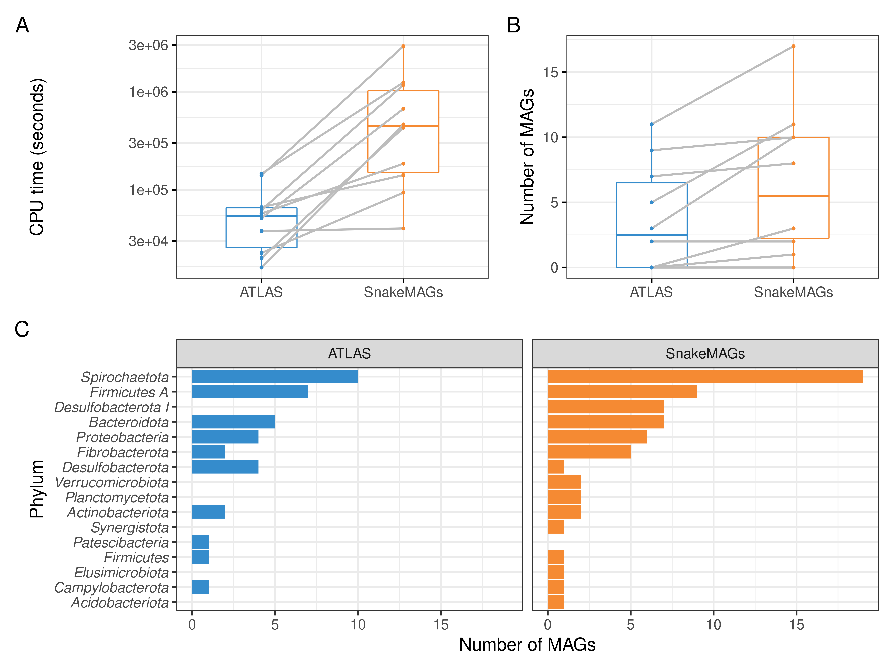

# Summary
Over the last decade, we have observed in microbial ecology a transition from gene-centric to genome-centric analyses [@Prosser:2015]. Indeed, the advent of metagenomics combined with binning methods, single cell genome sequencing as well as high-throughput cultivation methods have contributed to the continuing and exponential increase of available prokaryotic genomes, which in turn has favored the exploration of microbial metabolisms [@Almeida:2021]. In the case of metagenomics, data processing, from raw reads to genome reconstruction, involves various steps and softwares which can represent a major technical obstacle. To overcome this challenge, we developed `SnakeMAGs`, a simple workflow that can process Illumina data, from raw reads to metagenome-assembled genomes (MAGs) reconstruction, taxonomic classification and estimation of the relative abundance of these MAGs. Developed with the popular Snakemake workflow management system [@Molder:2021], it can be deployed on various architectures, from single to multicore and from workstation to computer clusters and grids. It is also flexible since users can easily change parameters and/or add new rules. Using termite gut metagenome datasets as an example, we showed that `SnakeMAGs` allowed the recovery of more MAGs encompassing more phyla compared to another similar workflow named ATLAS. Overall, it should make the reconstruction of MAGs more accessible to microbiologists. The package as well as test files and an extended tutorial are available on [GitHub](https://github.com/Nachida08/SnakeMAGs).

# Statement of need
Since the use of MAGs in microbial ecology is nowadays a common practice, several workflows such as MetaWRAP [@Uritskiy:2018], ATLAS [@Kieser:2020] and very recently MAGNETO [@Churcheward:2022], have been developed to automatically reconstruct genomes from metagenomes. However, these workflows contain various modules and perform more tasks than only generating MAGs. For instance, they will taxonomically assign the metagenomic reads, create gene catalog or perform functional annotations. They rely on numerous dependencies, require significant computational resources and regenerate a lot of outputs which are not essential to most research projects. To simplify this procedure and make it more accessible while remaining efficient and biologically relevant, we developed `SnakeMAGs`, a configurable and easy-to-use workflow to reconstruct MAGs in just a few steps. It integrates state-of-the-art bioinformatic tools to sequentially perform from Illumina raw reads: quality filtering of the reads with illumina-utils [@Eren:2013], adapter trimming with Trimmomatic [@Bolger:2014]), an optional step of host sequence removal with Bowtie2 [@Langmead:2012]), assembly of the reads with MEGAHIT [@Li:2015], binning of the contigs with MetaBAT2 [@Kang:2019], quality assessment of the bins with CheckM [@Parks:2015], classification of the MAGs with GTDB-Tk [@Chaumeil:2020] and estimation of the relative abundance of these MAGs with CoverM [@Woodcroft:2021] (Figure 1).

# Performance
To demonstrate the benefits of our workflow, we compared it to another Snakemake workflow named ATLAS v2.9.1 [@Kieser:2020], using MEGAHIT assembler, without co-binning and dereplicating only 100% similar MAGs. To do so, we analyzed ten publicly available termite gut metagenomes (accession numbers: SRR10402454; SRR14739927; SRR8296321; SRR8296327; SRR8296329; SRR8296337; SRR8296343; DRR097505; SRR7466794; SRR7466795) from five studies [@Calusinska:2020; @Moreira:2021; @Romero:2020; @Tokuda:2018; @Waidele:2019] and belonging to ten different termite species. ATLAS appeared to be faster than `SnakeMAGs` to reconstruct MAGs from metagenomes (Figure 2A). However, `SnakeMAGs` recovered more MAGs (>50% completeness and >10% contamination according to CheckM) per metagenome or at least as much as ATLAS (Figure 2B). More importantly our results showed that `SnakeMAGs` was able to recover MAGs encompassing the major bacterial phyla found in termite guts [@Arora:2022; @Herve:2020], and that some of these phyla were not recovered by ATLAS (Figure 2C). Therefore, `SnakeMAGs` has the potential to retrieve quantitatively more genomic information from metagenomes but also to extract genomic features of biological interest.

# Figures

**Figure 1.** Directed acyclic graph describing the main steps performed by `SnakeMAGs`. The names of the softwares used for each step are showed in parentheses.

**Figure 2.** Comparison of the performance of `SnakeMAGs` with another workflow, namely ATLAS v2.9.1 [@Kieser:2020] using 10 termite gut metagenomes. **A.** CPU time (in seconds) required to process each metagenome. **B.** Number of MAGs reconstructed from each metagenome. On both boxplots, gray lines link the result obtained with ATLAS and the one obtained with SnakeMAGs for each of the 10 analyzed termite metagenomes  **C.** Number of bacterial MAGs at the phylum level recovered from each workflow.

# Acknowledgements
This work was supported by the FEDER grant InFoBioS n°EX011185 (région Val de Loire, France) and the Centre National de la Recherche Scientifique (CNRS). Ph.D. work of Nachida Tadrent (Ph.D. scholarship) was funded by the University of Tours. The authors thank Emmanuelle Morin and Hélène Gardon for their valuable advice and feedback during the workflow development.

# References
